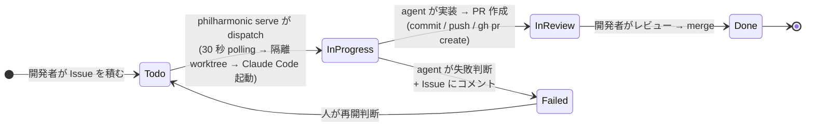

# Philharmonic

> **`philharmonic serve` を常駐させておけば、GitHub Projects v2 の Todo にチケットを積むだけで Claude Code が勝手に拾って Pull Request にしてくれる coding-agent オーケストレータ。**

[OpenAI Symphony](https://github.com/openai/symphony) から着想を得た TypeScript / Node.js 実装で、個人開発者や小規模チームが「やりたいけど手が回っていないタスク」を Claude Code に少しずつ消化させたいときに使えます。

## 全体像 — Issue を積んで PR を merge するだけ



**開発者がやること**: Issue を Todo に積む / PR をレビューして merge する — それだけです。worktree 作成 / Claude Code 起動 / 実装 / commit / push / PR 作成 / Status 遷移は Philharmonic と agent が代行します。最後の merge 判断だけは必ず人間に残ります。

## なぜ Philharmonic を使うのか

- **チケットを積むだけで自動 dispatch**: `philharmonic serve` を常駐させると、Project の Todo に Issue が積まれた瞬間 (次の polling tick) に候補選定 → worktree 作成 → Claude Code 起動 まで自動でやり切る。以降の commit / push / PR 作成 / Status 遷移 / 必要に応じた Issue コメントは agent (Claude Code + `gh` CLI) が prompt 指示に従って完結する ([ADR-0005](./docs/adr/0005-thin-orchestrator-agent-delegation.md))
- **Issue 本文は自由フォーマット**: `## Goal` / `## Constraints` / `## Acceptance Criteria` の必須セクション制約は撤廃。本文はそのまま agent に渡される
- **タスクごとに git worktree で隔離**: 作業は `.philharmonic/worktrees/issue-<番号>/` の中だけ。ホスト環境を汚さず、複数タスクを並行して試せる
- **daemon 運用に必要なものが揃っている**: SIGTERM で in-flight 完了待ちの graceful shutdown、起動時に `In Progress` を引き取る recovery、`max_concurrent_agents` で並列 dispatch、二重起動を防ぐ lock file、`localhost` の Snapshot HTTP API (`/api/v1/state`) で dashboard 連携も可能
- **`.philharmonic/WORKFLOW.md` で prompt をカスタマイズ**: Liquid テンプレートでリポジトリごとに Claude への指示を自由に組み立てられる
- **Lifecycle hooks**: workspace 作成直後に `pnpm install`、削除直前に cleanup スクリプト、といった shell コマンドをイベントごとに差し込める

## 1 分で動かす

前提: Node.js 22 LTS / pnpm / [Claude Code CLI](https://docs.claude.com/en/docs/claude-code) / GitHub Projects v2 / GitHub PAT (対象リポジトリの `Contents: RW` / `Pull requests: RW` / `Issues: RW` + 対象 user/org の `Projects: RW`)

```sh
# 1) Philharmonic をビルド & コマンドにパスを通す
git clone https://github.com/hexylab/philharmonic.git
cd philharmonic
corepack enable
pnpm install && pnpm build
pnpm link --global

# 2) GitHub 認証を整える (gh auth login 済みなら追加設定不要 / config の default は github.token_source: auto)
gh auth login                              # 推奨経路
# あるいは env を使う場合:
# export GITHUB_TOKEN=ghp_xxxxxxxxxxxxxxxxxxxx

# 3) 動かしたい先のリポジトリに .philharmonic/philharmonic.yaml を置く (#67)
cd /path/to/your-repo
mkdir -p .philharmonic
cat > .philharmonic/philharmonic.yaml <<'EOF'
owner: your-github-login
project_number: 1
permission_mode: bypass         # ADR-0005: agent 委譲には実用上必須
safety:
  allow_bypass_in_serve: true   # serve で bypass を使う opt-in (env でも可)
EOF

# 4) 常駐デーモンを起動 (30 秒ごとに Project Todo を polling)
philharmonic serve
```

これで Philharmonic が立ち上がります。あとは Project の Todo に Issue を積めば、次の polling tick で自動的に dispatch され、`stderr` の構造化ログに `dispatch success run-id=... issue=#... pr=#...` が流れて Pull Request が立ちます。停止したいときは **Ctrl+C** (または SIGTERM) を送れば、in-flight の run の完了を待ってから graceful に exit します。

> 1 件だけ単発で試したい場合や、cron / GitHub Actions の `schedule` から呼びたい場合は `philharmonic run` を使えます (1 ターンで exit する単発モード)。

ステップごとの詳しい手順 (Project Status の整備 / Issue 本文の書きかた / 候補確認コマンド / Snapshot API での観測 等) は [`docs/guide/getting-started.md`](./docs/guide/getting-started.md) を参照してください。

## ユーザガイド

| ドキュメント                                                       | 内容                                                                                     |
| ------------------------------------------------------------------ | ---------------------------------------------------------------------------------------- |
| [`docs/guide/README.md`](./docs/guide/README.md)                   | ユーザガイドの目次と、1 ターンで何が起きるかの全体像                                     |
| [`docs/guide/getting-started.md`](./docs/guide/getting-started.md) | 前提・インストール・最小設定・Project Status 整備・初回実行までの一気通貫                |
| [`docs/guide/configuration.md`](./docs/guide/configuration.md)     | `philharmonic.yaml` / `WORKFLOW.md` / lifecycle hooks のカスタマイズ                     |
| [`docs/guide/operations.md`](./docs/guide/operations.md)           | CLI コマンド / 構造化ログ / `.philharmonic/runs/` / Snapshot HTTP API / トラブルシュート |

## もっと知る

- 機能仕様の真実 (フィールド全表 / state machine / API 全定義): [`docs/specs/`](./docs/specs/)
- 設計判断の記録 (なぜそう決めたか): [`docs/adr/`](./docs/adr/)
- リポジトリへのコントリビュート (ブランチ戦略 / コミット規約 / PR ルール / ドキュメント運用): [`AGENTS.md`](./AGENTS.md)

## ライセンス

[MIT](./LICENSE)
