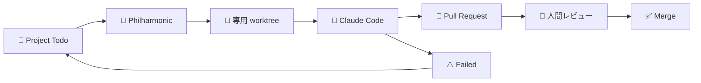

# Philharmonic

<p align="center">
  <strong>GitHub Projects の Todo を、Claude Code が Pull Request に変える。</strong>
</p>

<p align="center">
  <a href="./LICENSE"></a>
  
  
  
  
</p>

**Philharmonic** は、GitHub Projects v2 と Claude Code をつなぐ coding-agent オーケストレータです。

Issue を Project の **Todo** に置くと、Philharmonic が作業場所を用意し、Claude Code が実装して Pull Request を作ります。

> Inspired by [OpenAI Symphony](https://github.com/openai/symphony)。

## 何ができる？

| アイコン | できること                 | 説明                                                    |
| :------: | -------------------------- | ------------------------------------------------------- |
|    🎫    | Issue を自動で拾う         | Project の Todo を polling して、次のタスクを見つけます |
|    🤖    | Claude Code を起動する     | headless mode の Claude Code に実装を任せます           |
|    🌿    | 作業場所を分ける           | タスクごとに git worktree を作り、作業を隔離します      |
|    🔀    | Pull Request を作る        | commit / push / PR 作成まで agent が進めます            |
|    🪢    | 依存関係で順序を制御する   | Issue 本文の `Depends-On:` 行で先行・後続を表現できます |
|    👀    | 最後は人がレビューする     | merge 判断は自動化せず、人間に残します                  |
|    🧩    | リポジトリごとに調整できる | prompt や lifecycle hook をカスタマイズできます         |

## どう動く？



基本の流れはこれだけです。

1. 開発者が Issue を Project の **Todo** に置く
2. `philharmonic serve` が Todo を見つける
3. タスク用の git worktree を作る
4. Claude Code が実装する
5. agent が Pull Request を作る
6. 人間がレビューして merge する

## 向いている用途

- 個人開発や小規模チームの自動実装補助
- 「いつか直したい」Issue の継続的な消化
- Claude Code に任せるタスクの実験
- Project board を中心にした開発フロー

## 必要なもの

| 必要なもの             | 備考                                       |
| ---------------------- | ------------------------------------------ |
| Node.js                | 22 LTS 以上                                |
| pnpm                   | Corepack 経由を推奨                        |
| Claude Code CLI        | `claude` コマンドが使える状態              |
| GitHub CLI             | `gh auth login` 済みを推奨                 |
| GitHub Projects v2     | Issue を並べる Project board               |
| GitHub token / gh 認証 | repo と Project への読み書き権限が必要です |

## クイックスタート

### 1. Philharmonic をインストールする

```sh
git clone https://github.com/hexylab/philharmonic.git
cd philharmonic
corepack enable
pnpm install
pnpm build
pnpm link --global
```

### 2. GitHub 認証を用意する

通常は GitHub CLI の認証で十分です。

```sh
gh auth login
```

CI、systemd、cron などで動かす場合は環境変数も使えます。

```sh
export GITHUB_TOKEN=ghp_xxxxxxxxxxxxxxxxxxxx
```

### 3. 使いたいリポジトリで初期化する

Philharmonic を動かしたいリポジトリに移動して実行します。

```sh
cd /path/to/your-repo
philharmonic init
```

非対話で作る場合はこちらです。

```sh
philharmonic init --yes --owner your-github-login --project 1
```

### 4. daemon を起動する

```sh
philharmonic serve
```

あとは Project の **Todo** に Issue を置くだけです。

## よく使うコマンド

| やりたいこと           | コマンド                     |
| ---------------------- | ---------------------------- |
| 設定ファイルを作る     | `philharmonic init`          |
| Todo の候補を見る      | `philharmonic projects list` |
| 1 回だけ実行する       | `philharmonic run`           |
| 常駐して自動 dispatch  | `philharmonic serve`         |
| 失敗 Issue を再実行    | `philharmonic retry <n>`     |
| 古い作業場所を掃除する | `philharmonic clean`         |
| daemon の状態を見る    | `philharmonic dashboard`     |

## 安全に使うための注意

Claude Code が `git push` や `gh pr create` を実行するには、実用上 `permission_mode: bypass` が必要です。

そのため、`philharmonic serve` で bypass を使う場合は明示的な opt-in が必要です。

```yaml
# .philharmonic/philharmonic.yaml
safety:
  allow_bypass_in_serve: true
```

または環境変数でも有効化できます。

```sh
export PHILHARMONIC_ALLOW_BYPASS_IN_SERVE=1
```

詳しい背景は [ADR-0005](./docs/adr/0005-thin-orchestrator-agent-delegation.md) を参照してください。

## 詳しいドキュメント

| 読みたいこと                 | ドキュメント                                                                                   |
| ---------------------------- | ---------------------------------------------------------------------------------------------- |
| まず 1 件 PR を作りたい      | [Getting Started](./docs/guide/getting-started.md)                                             |
| 設定を変えたい               | [Configuration](./docs/guide/configuration.md)                                                 |
| 運用・ログ・掃除             | [Operations](./docs/guide/operations.md)                                                       |
| Issue の順序制約を表現したい | [DAG scheduling 運用](./docs/guide/operations.md#依存関係付き-issue-を運用する-dag-scheduling) |
| 仕様を確認したい             | [Specs](./docs/specs/)                                                                         |
| 設計判断を知りたい           | [ADR](./docs/adr/)                                                                             |
| 開発ルールを確認したい       | [AGENTS.md](./AGENTS.md)                                                                       |

## ライセンス

[MIT](./LICENSE)
